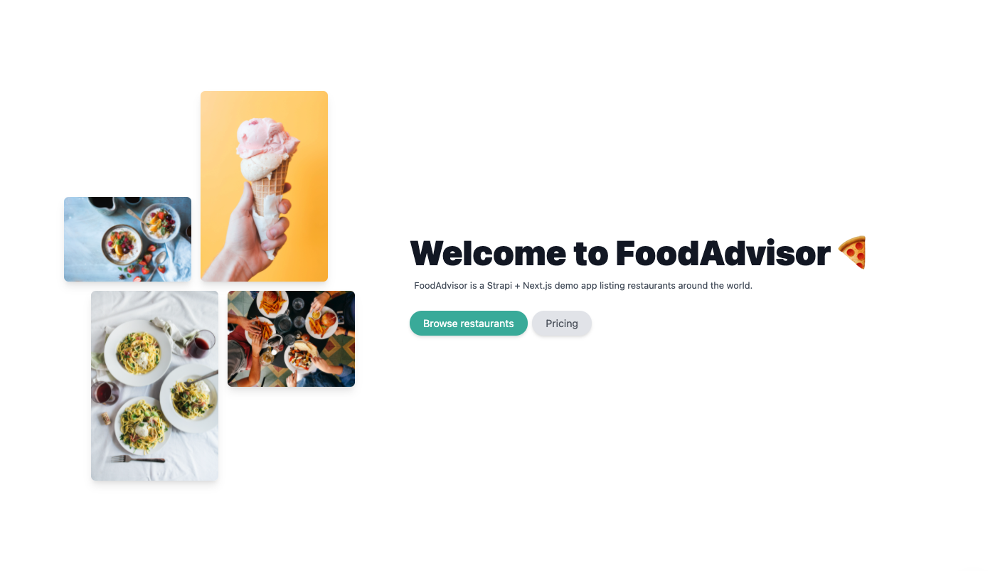

# FoodAdvisor



Welcome to FoodAdvisor, the official Strapi demo application.
This repository contains the following:

- Strapi project with existing Content-types and data (`/api`)
- Next.js client ready to fetch the content of the Strapi application (`/client`)

## Prerequisites

Be sure to have the correct env variables for each part:

- Strapi (example in `./api/.env.example`):
  - `STRAPI_ADMIN_CLIENT_URL=<url-of-nextjs>`
  - `STRAPI_ADMIN_CLIENT_PREVIEW_SECRET=<a-random-token>`

- Next.js (already in `./client/.env.development`):
  - `NEXT_PUBLIC_API_URL=<url-of-strapi>`
  - `PREVIEW_SECRET=<the-same-random-token-as-for-strapi>`

## 1. Clone FoodAdvisor

- Clone the repository by running the following command:

```
git clone https://github.com/shayan-ataei/foodadvisor-page.git
```

- Navigate to your project folder by running `cd foodadvisor`.

## 2. Start Strapi

Navigate to your `./my-projects/foodadvisor/api` folder by running `cd api` from your command line.

- Run the following command in your `./foodadvisor/api` folder:

```
yarn && yarn seed && yarn develop
```

This will install the dependencies, fill your application with data and run your server. You can run these commands separately.

#### Credentials

- Super Admin:
  - email: admin@strapidemo.com
  - password: welcomeToStrapi123

- Editor
  - email: editor@strapidemo.com
  - password: welcomeToStrapi123

- Author
  - email: author@strapidemo.com
  - password: welcomeToStrapi123

## 3. Start Next.js

Navigate to your `./my-projects/foodadvisor/client` folder by running `cd client` from your command line.

- Run the following command in your `./foodadvisor/client` folder

```
yarn && yarn dev
```

This will install the dependencies, and run your server. You can run these commands separately.